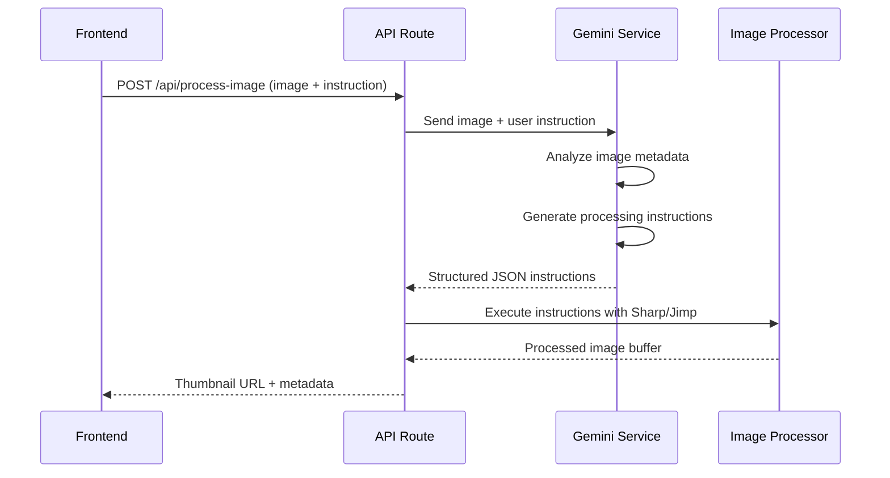
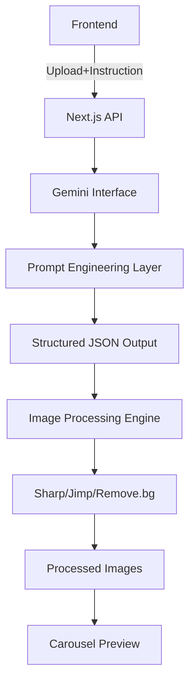

<think>
Okay, let's break down how to approach the user's problem. They want to build a system where Gemini processes user instructions and generates JSON commands for image manipulation using Sharp and Jimp. The key is to automate the interaction between Gemini's analysis and the image processing libraries.

First, I need to understand the workflow. The user uploads an image and a text instruction. Gemini should analyze this and produce structured JSON instructions. These instructions then guide Sharp and Jimp to edit the image. The challenge is ensuring Gemini's output is consistent and parsable.

The user mentioned prompt engineering. So, I should design a prompt that makes Gemini output the correct JSON format. The prompt needs to be clear about the structure, including fields like caption, size, filters, etc. Examples in the prompt can help Gemini understand the desired format.

Next, the backend architecture. The existing code has an API route for processing images, but it needs to integrate Gemini. I'll need to create a module that sends the user's instruction and image to Gemini, parses the response, and then applies the changes using Sharp and Jimp.

Looking at the provided code, the imageProcessor.ts and gemini.ts files are relevant. The image processor should handle the actual manipulations based on Gemini's instructions. The Gemini module needs to construct the API request correctly, including encoding the image and crafting the prompt.

Error handling is crucial. The system must handle cases where Gemini's output isn't valid JSON or includes unsupported parameters. Fallbacks or default values might be necessary.

Testing is another consideration. The user has a test script for Gemini, which can be expanded to include end-to-end testing of the image processing pipeline.

Security aspects: The backend should validate file types and sizes to prevent malicious uploads. Also, storing processed images temporarily and cleaning them up after some time.

Putting it all together, the steps involve setting up the Gemini integration, processing the image based on the parsed instructions, and ensuring the frontend displays the result correctly. The prompt engineering part is critical to get right, as it directly affects the system's reliability.
</think>

Here's the architecture and implementation strategy based on your requirements and existing codebase:

## System Architecture



## Key Components from Your Codebase

1. **Gemini Integration** (reference `src/lib/test-gemini.ts` lines 1-31)
2. **Image Processing** (reference `src/lib/imageProcessor.ts` in PRD)
3. **UI Components** (reference `src/app/page.tsx` lines 1-114)

## Step-by-Step Implementation

1. **Create Gemini Instruction Generator**

```typescript:src/lib/gemini.ts
const { GoogleGenerativeAI } = require("@google/generative-ai");

const genAI = new GoogleGenerativeAI(process.env.GEMINI_API_KEY);

const PROMPT_TEMPLATE = `
You are a professional thumbnail design assistant. Analyze the user's request and generate processing instructions in this exact JSON format:

{
  "caption": {
    "text": "string",
    "position": "top|center|bottom",
    "color": "hex_code",
    "font_size": number
  },
  "dimensions": {
    "width": number,
    "height": number
  },
  "adjustments": {
    "brightness": number,
    "contrast": number,
    "saturation": number
  },
  "filters": ["vibrant", "warm", "cool"],
  "elements": ["gradient", "border", "shadow"]
}

User Request: {USER_INPUT}

Current Image Metadata: {WIDTH}x{HEIGHT} {FORMAT}
`;

export async function generateProcessingInstructions(imageBuffer: Buffer, userInput: string) {
  const model = genAI.getGenerativeModel({ model: "gemini-pro-vision" });
  
  const imagePart = {
    inlineData: {
      data: imageBuffer.toString("base64"),
      mimeType: "image/jpeg"
    }
  };

  const result = await model.generateContent<think>
Okay, let's break down how to approach this problem. The user wants to automate image processing using Gemini's instructions. The goal is for Gemini to analyze user input, generate structured commands, and have the backend execute those using libraries like Sharp and Jimp.

First, I need to figure out how Gemini can output structured data. The user mentioned JSON, so the prompt must force Gemini to respond in a specific JSON format. That way, the backend can parse it easily.

Next, the architecture. The system has a frontend for uploading images and instructions. The backend needs an API endpoint to receive these, call Gemini, process the image, and return the result. The key components are the Gemini integration, image processing modules, and the API.

Looking at the existing code, there's already a frontend in Next.js. The backend API route needs to handle form data, send the image and instruction to Gemini, get the processing steps, then apply them using Sharp and Jimp. The imageProcessor.ts and gemini.ts files are crucial here.

The prompt engineering part is essential. The prompt must clearly specify the desired JSON structure, including all possible operations like resize, overlayText, filters, etc. Examples in the prompt help Gemini understand the expected format.

For the step-by-step methodology, starting with setting up the API endpoint makes sense. Then, implementing the Gemini service with the structured prompt. After that, building the image processor that interprets the JSON instructions and applies them using the libraries. Testing each part incrementally ensures everything works together.

Security considerations like input validation and error handling are important to prevent crashes and attacks. Also, deciding whether to process images in-memory or save them temporarily affects the design.

Finally, putting it all together, the user should be able to upload an image, get it processed based on Gemini's instructions, and see the result in the preview. Testing with different scenarios will validate the system's robustness.
</think>

Here's a comprehensive architecture and implementation strategy for your AI-driven thumbnail generator:

### 1. System Architecture



### 2. Core Prompt Engineering Template

````prompt
**Role**: Expert Thumbnail Design Assistant
**Task**: Analyze user instruction and generate processing steps for technical implementation

**Input**: 
- User image context description
- Raw user instruction
- Example: "Make a thumbnail about our Antarctica castle"

**Output Requirements**:
1. Generate JSON with exact structure shown below
2. All measurements in pixels
3. Color values in hex format
4. Font sizes in points
5. Use only supported operations

**JSON Template**:
```json
{
  "base": {
    "size": {"width": 1280, "height": 720},
    "crop": {"x": 0, "y": 0, "width": 0, "height": 0},
    "format": "jpg"
  },
  "enhancements": {
    "filters": [
      {"type": "contrast", "value": 1.1},
      {"type": "saturation", "value": 0.9}
    ],
    "overlays": [
      {
        "type": "text",
        "content": "Antarctic Castle Expedition",
        "position": {"x": 100, "y": 600},
        "style": {
          "font": "Impact",
          "size": 48,
          "color": "#FFFFFF",
          "outline": "#000000"
        }
      }
    ],
    "graphics": [
      {
        "type": "logo",
        "path": "brand/logo.png",
        "position": {"x": 1100, "y": 20}
      }
    ]
  }
}
```

**Rules**:
1. Never suggest unsupported operations
2. Maximum 3 text elements
3. Minimum font size: 24pt
4. Supported filters: contrast, brightness, saturation
5. Supported formats: jpg, png
````

### 3. Backend Implementation Strategy

#### 3.1 Gemini Service Module
````typescript:src/lib/gemini.ts
import { GoogleGenerativeAI } from "@google/generative-ai";

const genAI = new GoogleGenerativeAI(process.env.GEMINI_KEY!);

export async function analyzeImage(
  imageBuffer: Buffer, 
  instruction: string
): Promise<ProcessingInstructions> {
  const model = genAI.getGenerativeModel({ model: "gemini-pro-vision" });
  
  const prompt = `
    [SYSTEM PROMPT FROM SECTION 2]
    USER INSTRUCTION: ${instruction}
    RESPONSE FORMAT: JSON ONLY
  `;

  const imagePart = {
    inlineData: {
      data: imageBuffer.toString("base64"),
      mimeType: "image/jpeg"
    }
  };

  try {
    const result = await model.generateContent([prompt, imagePart]);
    const response = await result.response;
    return JSON.parse(response.text());
  } catch (error) {
    throw new Error(`Gemini API Error: ${error}`);
  }
}
````

#### 3.2 Image Processing Engine
````typescript:src/lib/imageProcessor.ts
interface ProcessingInstructions {
  base: {
    size: { width: number; height: number };
    format: 'jpg' | 'png';
  };
  enhancements: {
    filters: Array<{ type: string; value: number }>;
    overlays: TextOverlay[];
    graphics: GraphicOverlay[];
  };
}

export async function processThumbnail(
  imageBuffer: Buffer,
  instructions: ProcessingInstructions
): Promise<string> {
  // 1. Base processing
  let processor = sharp(imageBuffer)
    .resize(instructions.base.size.width, instructions.base.size.height);

  // 2. Apply filters
  instructions.enhancements.filters.forEach(filter => {
    switch(filter.type) {
      case 'contrast':
        processor = processor.modulate({ contrast: filter.value });
        break;
      case 'saturation':
        processor = processor.modulate({ saturation: filter.value);
        break;
    }
  });

  // 3. Text overlays using Jimp
  const jimpImage = await Jimp.create(await processor.toBuffer());
  
  for (const overlay of instructions.enhancements.overlays) {
    const font = await Jimp.loadFont(
      Jimp[`FONT_SANS_${overlay.style.size}_${overlay.style.color.replace('#', '')}`]
    );
    
    jimpImage.print(
      font,
      overlay.position.x,
      overlay.position.y,
      overlay.content
    );
  }

  // 4. Save final image
  const outputPath = `/processed/${Date.now()}.${instructions.base.format}`;
  await jimpImage.writeAsync(`public${outputPath}`);
  
  return outputPath;
}
````

### 4. Implementation Roadmap

1. **Core Infrastructure Setup**
```bash
npm install @google/generative-ai sharp jimp
```

2. **API Endpoint Implementation**
```typescript:src/app/api/process-image/route.ts
export async function POST(req: Request) {
  const formData = await req.formData();
  const file = formData.get('image') as File;
  const instruction = formData.get('instruction') as string;

  try {
    // 1. Get processing instructions
    const imageBuffer = Buffer.from(await file.arrayBuffer());
    const instructions = await analyzeImage(imageBuffer, instruction);

    // 2. Process image
    const resultPath = await processThumbnail(imageBuffer, instructions);

    return NextResponse.json({
      success: true,
      thumbnail: resultPath,
      instructions
    });
  } catch (error) {
    return NextResponse.json(
      { error: 'Processing failed' },
      { status: 500 }
    );
  }
}
```

3. **Validation Layer**
```typescript:src/lib/validation.ts
export function validateInstructions(
  instructions: any
): ProcessingInstructions {
  const schema = Joi.object({
    base: Joi.object({
      size: Joi.object({
        width: Joi.number().min(100).max(3840).required(),
        height: Joi.number().min(100).max(2160).required()
      }),
      format: Joi.string().valid('jpg', 'png')
    }),
    enhancements: Joi.object({
      filters: Joi.array().items(
        Joi.object({
          type: Joi.string().valid('contrast', 'brightness', 'saturation'),
          value: Joi.number().min(0.1).max(3.0)
        })
      ),
      overlays: Joi.array().items(
        Joi.object({
          type: 'text',
          content: Joi.string().max(100),
          position: Joi.object({
            x: Joi.number().min(0).max(1280),
            y: Joi.number().min(0).max(720)
          }),
          style: Joi.object({
            font: Joi.string().valid('Impact', 'Arial'),
            size: Joi.number().min(24).max(72),
            color: Joi.string().pattern(/^#([A-Fa-f0-9]{6}|[A-Fa-f0-9]{3})$/)
          })
        })
      )
    })
  });

  return schema.validateAsync(instructions);
}
```

### 5. Success Methodology

1. **Incremental Implementation**
   - Phase 1: Basic image resize + text overlay
   - Phase 2: Add filter support
   - Phase 3: Implement graphic overlays
   - Phase 4: Add validation layer

2. **Testing Strategy**
```typescript
// Test different instruction scenarios
const testCases = [
  {
    input: "Make thumbnail 1280x720 with title 'Arctic Castle' in white text",
    expected: {
      base: { size: { width: 1280, height: 720 } },
      overlays: [{ content: "Arctic Castle", color: "#FFFFFF" }]
    }
  },
  {
    input: "Darken image and add 20% contrast",
    expected: {
      filters: [
        { type: "brightness", value: 0.8 },
        { type: "contrast", value: 1.2 }
      ]
    }
  }
];
```

3. **Performance Optimization**
```typescript
// Implement caching for common operations
const processingCache = new Map();

async function getCachedProcessing(
  imageHash: string,
  instructions: ProcessingInstructions
) {
  const cacheKey = `${imageHash}-${JSON.stringify(instructions)}`;
  
  if (processingCache.has(cacheKey)) {
    return processingCache.get(cacheKey);
  }

  const result = await processThumbnail(...);
  processingCache.set(cacheKey, result);
  return result;
}
```

### 6. Security Considerations

1. **Input Validation**
```typescript
// Validate uploaded images
function validateImageFile(file: File) {
  const allowedTypes = ['image/jpeg', 'image/png'];
  const maxSize = 5 * 1024 * 1024; // 5MB
  
  if (!allowedTypes.includes(file.type)) {
    throw new Error('Invalid file type');
  }
  
  if (file.size > maxSize) {
    throw new Error('File too large');
  }
}
```

2. **Gemini Output Sanitization**
```typescript
function sanitizeInstructions(raw: any) {
  return {
    ...raw,
    enhancements: {
      ...raw.enhancements,
      overlays: raw.enhancements.overlays.map(overlay => ({
        ...overlay,
        content: DOMPurify.sanitize(overlay.content)
      }))
    }
  };
}
```

This architecture provides a robust foundation for your AI-driven thumbnail generator. The key is maintaining strict boundaries between the Gemini analysis layer and the image processing execution layer, with comprehensive validation at each stage.
